# WZMALLAS — Plataforma de e-commerce + gestión multi-cuenta MercadoLibre

Plataforma web **self-hosted** que combina dos sistemas en un mismo backend Node.js:

1. **Tienda web propia** (e-commerce) — catálogo, carrito, checkout con **MercadoPago**, cuentas de cliente, seguimiento de envíos y panel de administración.
2. **Stockroom** — back-office para gestionar inventario, ventas y cobros en **múltiples cuentas de MercadoLibre Argentina** desde una sola interfaz, sincronizando stock entre publicaciones equivalentes.

Todo corre sobre un servidor Node.js puro (sin frameworks) con PostgreSQL, notificaciones por Telegram y emails transaccionales.

## Capturas

### Tienda web (e-commerce)

#### Home
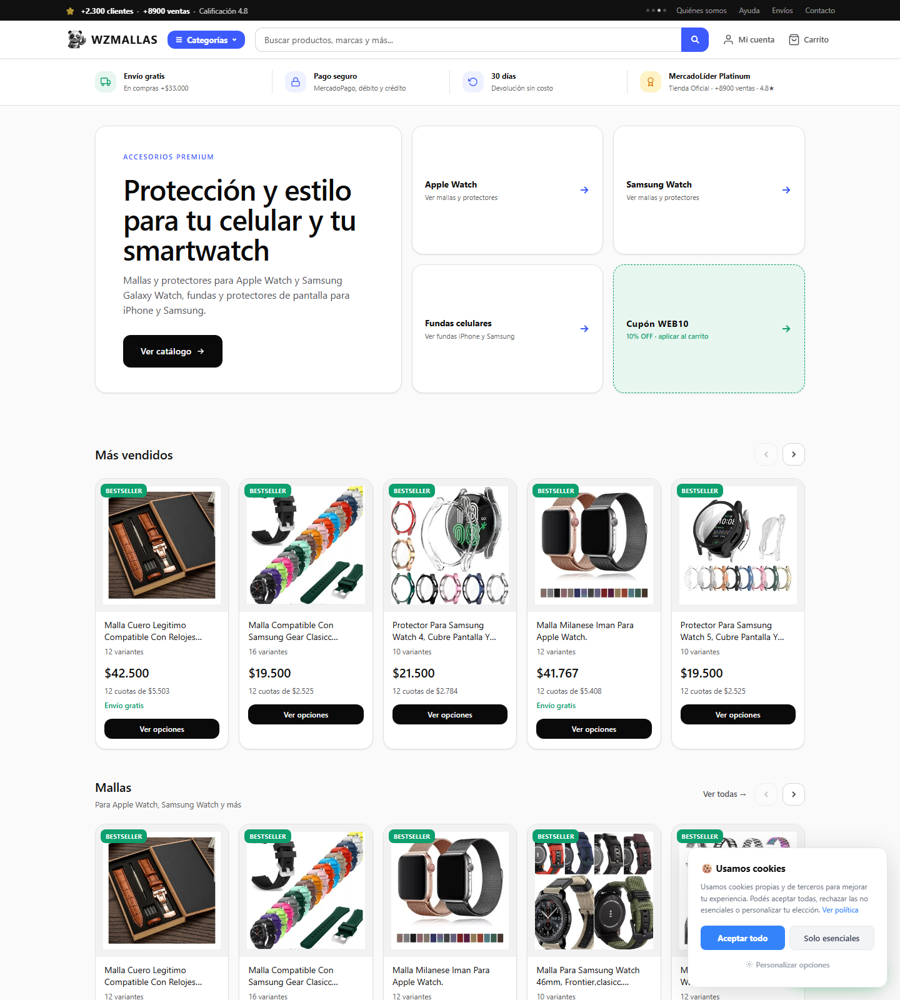

#### Catálogo
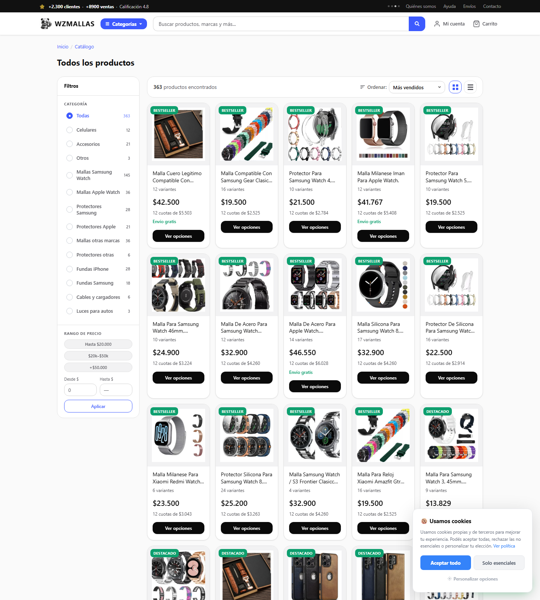

#### Página de producto
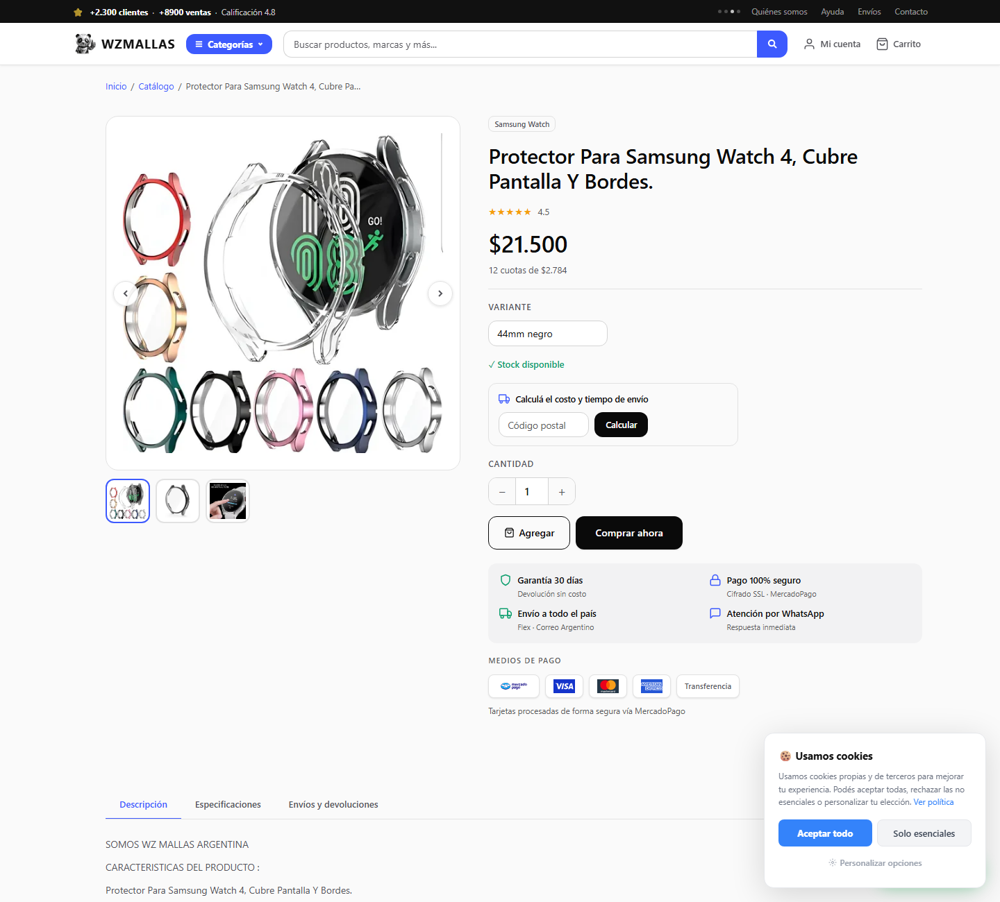

#### Cuenta de cliente
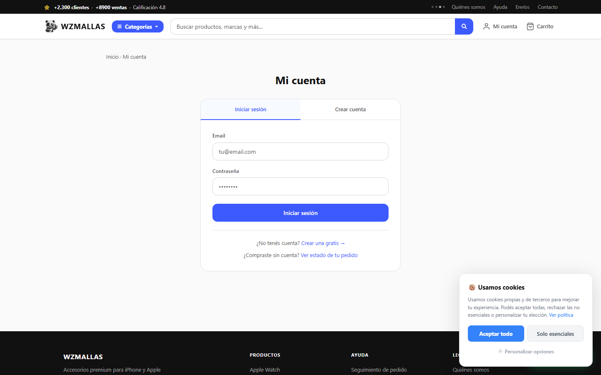

### Back-office (Stockroom)

### Dashboard
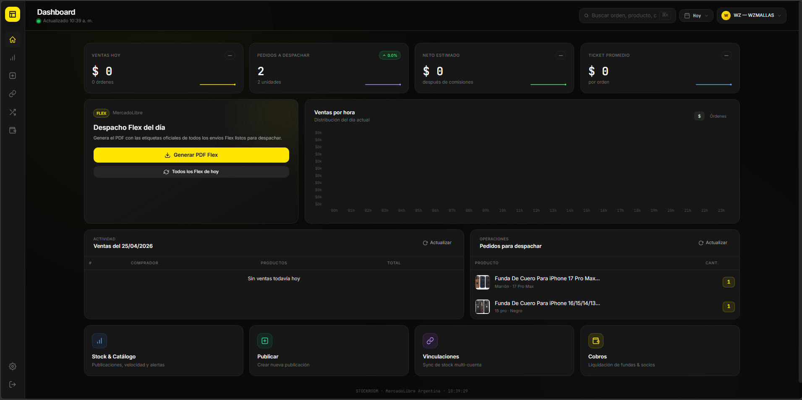

### Stock & Analytics


### Vinculaciones
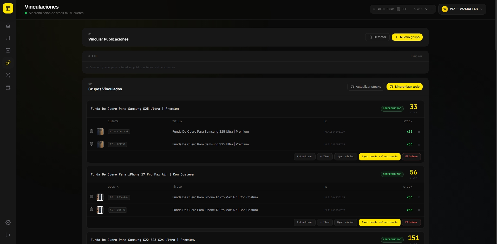

### Publicaciones
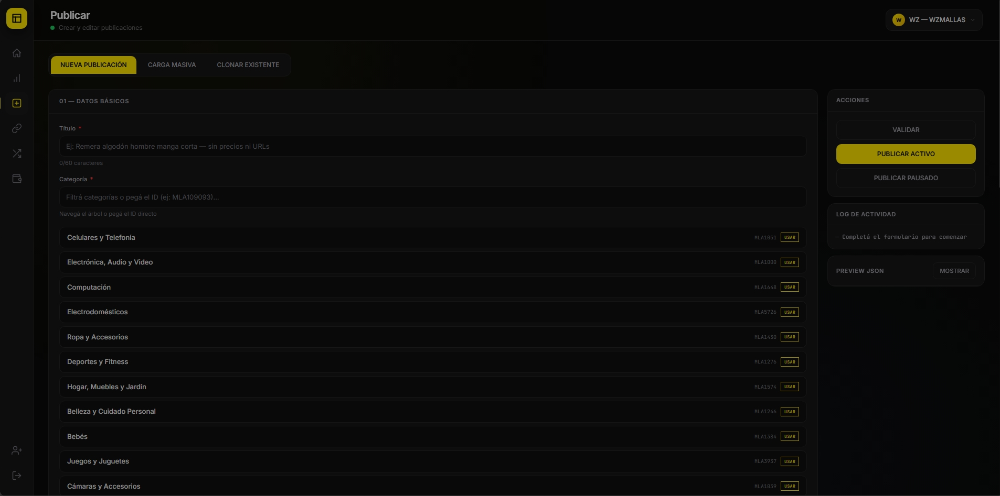

### Migración
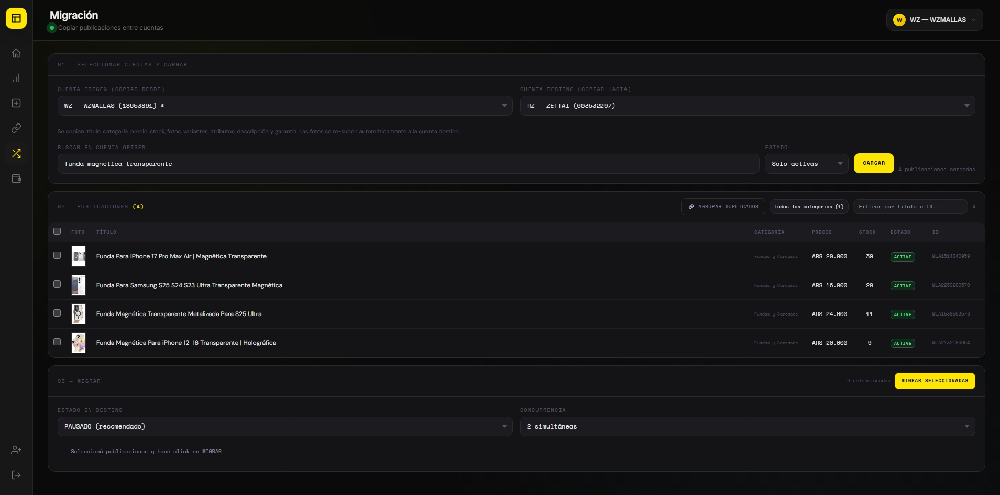

### Cobros
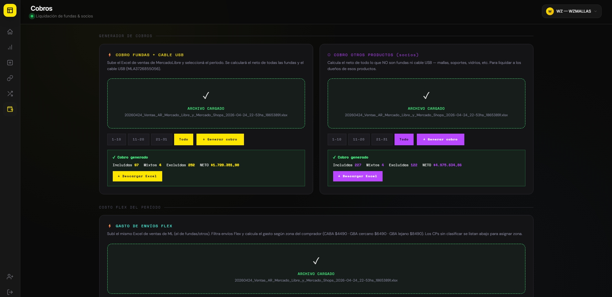
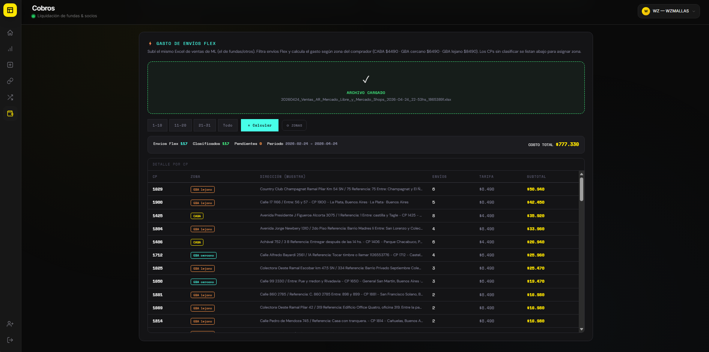
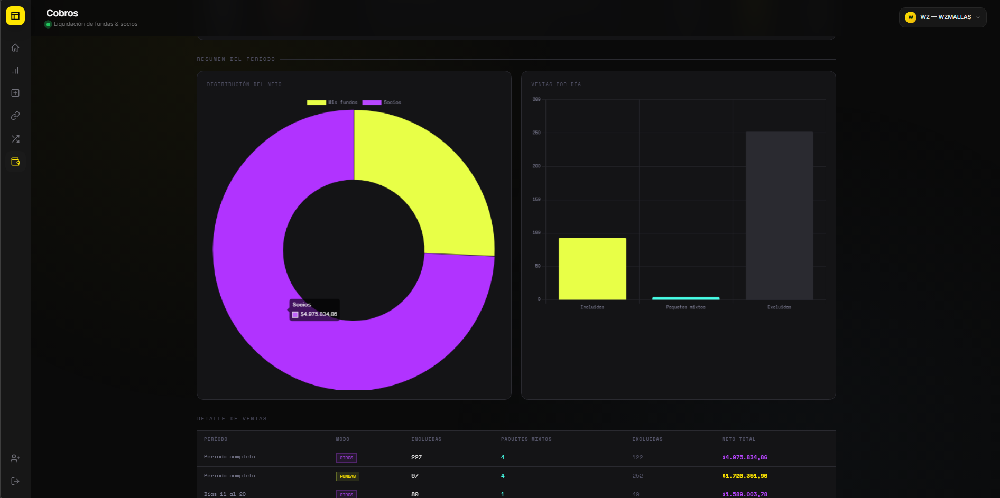

---

## ¿Qué resuelve?

MercadoLibre no ofrece panel multi-cuenta ni forma de sincronizar stock entre publicaciones idénticas en distintas cuentas. Y depender 100 % de ML implica comisiones altas y nula relación directa con el cliente.

Este proyecto resuelve ambos problemas: centraliza la operación de varias cuentas ML (reemplazando el flujo manual de Excel + paneles separados) **y** suma una tienda propia con cobro directo por MercadoPago, todo administrado desde el mismo lugar.

## Funcionalidades

### Tienda web (e-commerce)

| Módulo | Descripción |
|---|---|
| **Catálogo y PDP** | Listado y página de producto con SEO (meta description + JSON-LD `schema.org/Product`), variantes y stock en vivo |
| **Carrito y checkout** | Flujo de compra con cupones de descuento y pago por **MercadoPago** (checkout + webhook + polling de confirmación) |
| **Cuentas de cliente** | Registro/login, historial de órdenes, seguimiento de envíos |
| **Admin de tienda** | ABM de productos propios, categorías, órdenes, clientes, cupones y sincronización con catálogo ML |
| **Legales** | Páginas de términos, privacidad, cookies, cambios/devoluciones, botón de arrepentimiento (Ley 24.240) |

### Stockroom (gestión MercadoLibre)

| Módulo | Descripción |
|---|---|
| **Dashboard** | KPIs del día, pedidos para despachar (filtrados por estado real de envío) |
| **Stock & Analytics** | Inventario consolidado, gráficos de rotación, generador de órdenes de compra |
| **Vinculaciones** | Sincronización automática de stock entre publicaciones equivalentes en distintas cuentas (dry-run + aprobación manual vía Telegram) |
| **Publicaciones** | Creación y gestión con autocompletado de categorías ML |
| **Migración** | Duplicación de publicaciones entre cuentas con mapeo de variantes |
| **Cobros** | Liquidación cada 10 días. Cálculo de **costo Flex** parseando el Excel de ML por CP del comprador |
| **Preguntas / Despachos** | Gestión de preguntas ML y verificación de envíos |

## Stack

- **Backend**: Node.js puro (sin frameworks) — servidor HTTP con proxy ML (whitelist anti-SSRF), enrutado modular en `routes/` y ~30 módulos de dominio en `lib/`
- **Base de datos**: PostgreSQL (`pg`), con esquema y migraciones versionadas en `db/`
- **Pagos**: MercadoPago (Checkout API + webhook + polling de estado de pago)
- **Notificaciones**: bot de Telegram (avisos de venta, aprobación de ajustes de stock) + emails transaccionales (Nodemailer)
- **Procesamiento**: `sharp` (imágenes), `tesseract.js` + `pdf-parse` (OCR/extracción de resúmenes), scripts Python (openpyxl + pandas) para Excel de ventas ML
- **Frontend**: HTML5 + CSS vanilla con design-system propio + JavaScript vanilla — dark mode, PWA instalable
- **Auth**: OAuth 2.0 multi-cuenta con refresh automático de tokens

## Instalación

### Requisitos

- Node.js ≥ 18
- PostgreSQL ≥ 14
- Python 3.12 + pip (solo para los scripts de cobros)

```bash
npm install
pip install openpyxl pandas   # opcional: scripts de cobros
```

### Configuración

1. Clonar el repositorio.
2. Copiar `config.example.json` → `config.json` y completar con tus credenciales ML:

```json
{
  "active": "cuenta1",
  "accounts": [
    {
      "id": "cuenta1",
      "label": "Mi cuenta",
      "client_id": "TU_APP_ID",
      "client_secret": "TU_SECRET",
      "user_id": "",
      "access_token": "",
      "refresh_token": ""
    }
  ]
}
```

3. Registrar la app en [MercadoLibre Developers](https://developers.mercadolibre.com.ar/) con redirect URI `http://localhost:3000/oauth/callback`.
4. Crear la base PostgreSQL y correr las migraciones:

```bash
npm run migrate
```

### Ejecutar

```bash
npm start          # node server.js
```

Abrir [http://localhost:3000](http://localhost:3000). Para autorizar una cuenta ML: `http://localhost:3000/oauth/start`.

## Seguridad

- Whitelist de paths ML permitidos (previene usar el token para requests arbitrarios) — proxy anti-SSRF.
- CSP, HSTS, X-Frame-Options, COOP/CORP en todas las respuestas.
- Credenciales y datos personales (`config.json`, `*.json` de datos, tokens) excluidos del repo vía `.gitignore` y bloqueados por el servidor.
- Rate limiting y sesiones server-side.
- Recomendado detrás de Cloudflare Tunnel o VPN para acceso remoto.

## Archivos generados localmente (no en repo)

| Archivo | Contenido |
|---|---|
| `config.json` | Credenciales OAuth y tokens ML/MP |
| `vinculaciones.json` | Grupos de publicaciones vinculadas |
| `flex_zones.json` | Mapeo CP → zona de envío Flex |

## Estructura

```
server.js              Servidor Node.js (proxy ML + endpoints + bootstrap)
lib/                   ~30 módulos de dominio (ml-client, mercadopago, telegram,
                         payment-polling, email-sender, seo, cupones, shipping…)
routes/                Routers por sección (vinculaciones, despachos, flex, alibaba…)
db/                    pool.js, queries.js, schema.sql y migraciones
scripts/               smoke.sh (suite de smoke tests del deploy)
tienda/                Frontend del e-commerce (catálogo, carrito, checkout, cuenta)
*.html                 Páginas del back-office (dashboard, analytics, cobros, admin…)
genera_cobro.py        Procesamiento Excel ML (cobros)
genera_orden_compra.py Generador de órdenes de compra
flex_cost.py           Cálculo de costo Flex por Excel ML
sw.js                  Service Worker (PWA)
assets/                Capturas de pantalla
```

---

## Autor

**Rodrigo Nicolás Zapata**
[LinkedIn](https://linkedin.com/in/rnzapata) · [GitHub](https://github.com/rszapata)
