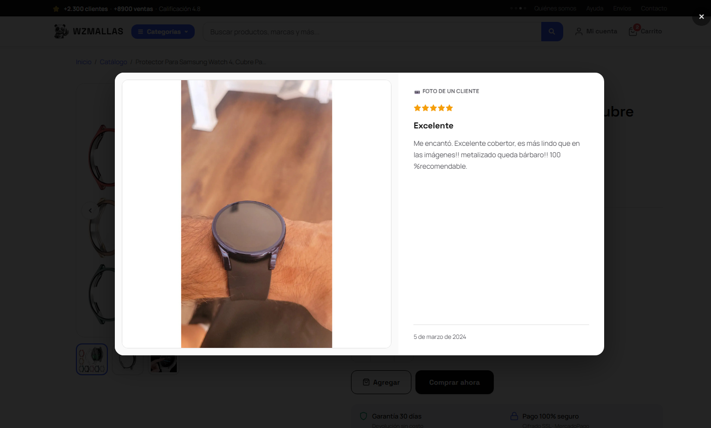
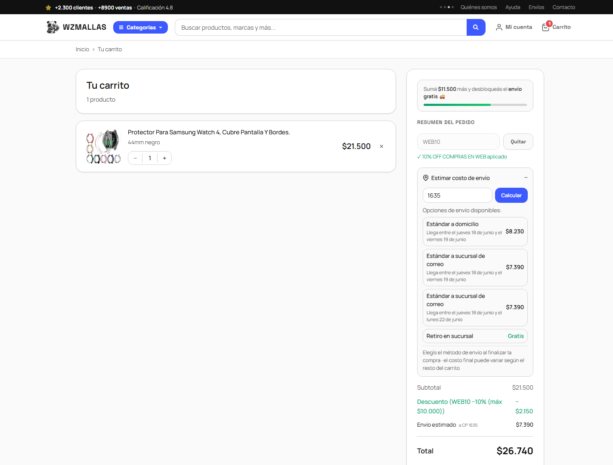
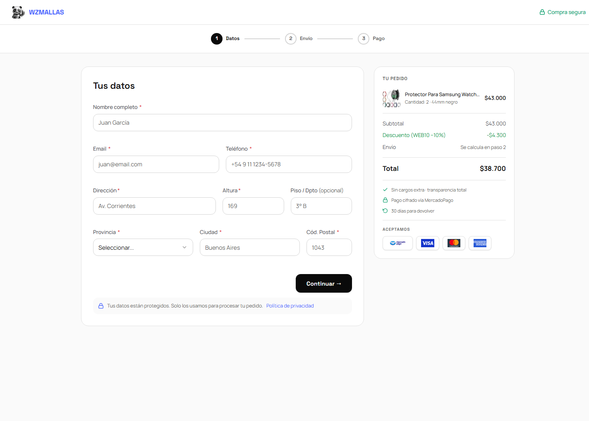
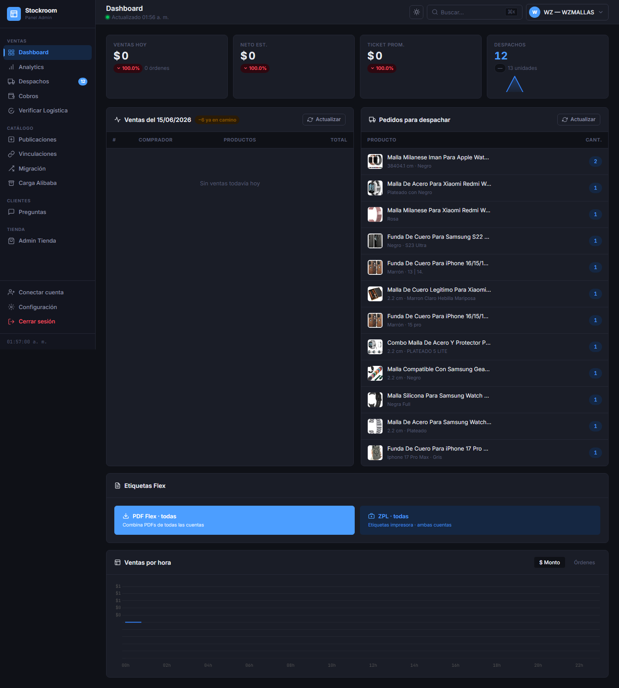
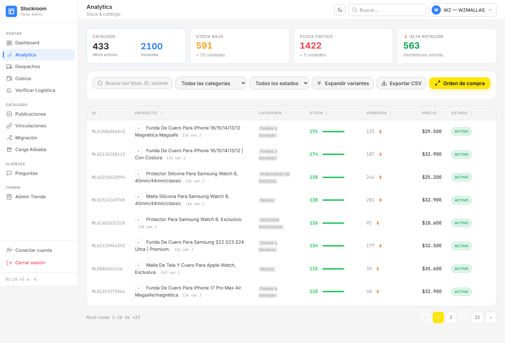
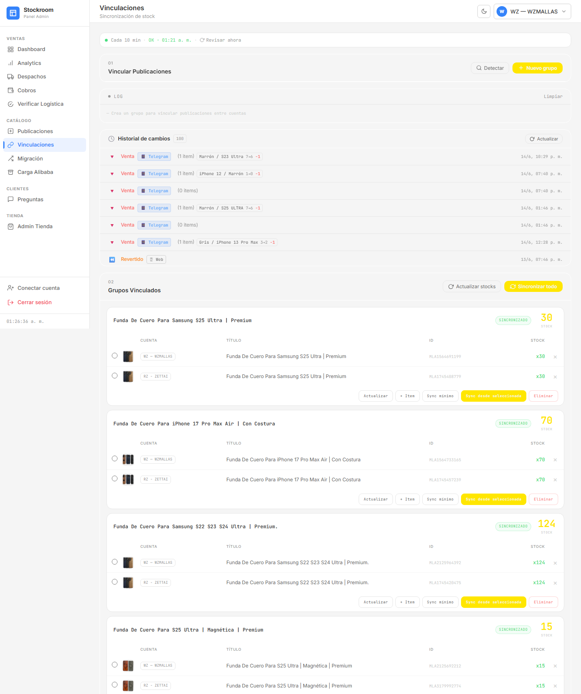
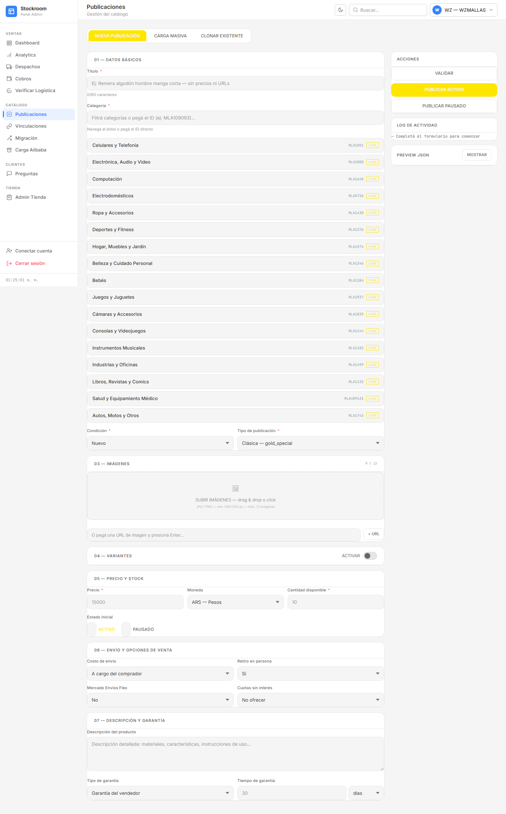
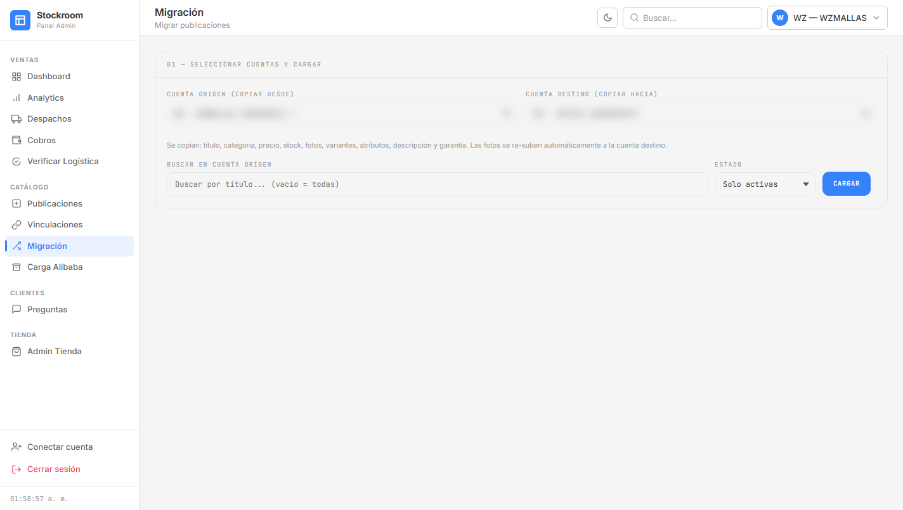
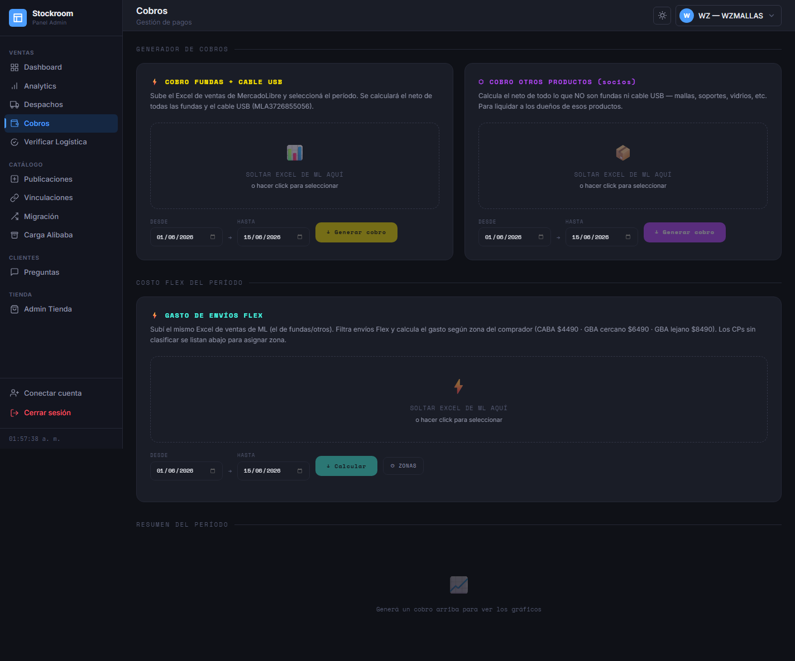
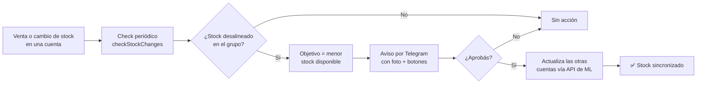

# WZMALLAS — Plataforma de e-commerce + gestión multi-cuenta MercadoLibre

Plataforma web **self-hosted** que combina dos sistemas en un mismo backend Node.js:

1. **Tienda web propia** (e-commerce) — catálogo, carrito, checkout con **MercadoPago**, cuentas de cliente, seguimiento de envíos y panel de administración.
2. **Stockroom** — back-office para gestionar inventario, ventas y cobros en **múltiples cuentas de MercadoLibre Argentina** desde una sola interfaz, sincronizando stock entre publicaciones equivalentes.

Todo corre sobre un servidor Node.js puro (sin frameworks) con PostgreSQL, notificaciones por Telegram y emails transaccionales.

🌐 **Demo en vivo (tienda real, en producción):** **[wzmallas.com](https://wzmallas.com)**

[](https://wzmallas.com)


## ¿Qué resuelve?

MercadoLibre no ofrece panel multi-cuenta ni forma de sincronizar stock entre publicaciones idénticas en distintas cuentas. Y depender 100 % de ML implica comisiones altas y nula relación directa con el cliente.

Este proyecto resuelve ambos problemas: centraliza la operación de varias cuentas ML (reemplazando el flujo manual de Excel + paneles separados) **y** suma una tienda propia con cobro directo por MercadoPago, todo administrado desde el mismo lugar.

## Capturas

### Tienda web (e-commerce)

#### Home
Primera impresión: hero, accesos por categoría, barra de confianza y cupón activo.


#### Catálogo
363 productos reales (sincronizados desde MercadoLibre) con filtros por categoría, precio y orden.


#### Página de producto
Galería, selector de variantes, cuotas, calculadora de envío por código postal y badges de confianza.


#### Reseñas importadas de MercadoLibre
Las opiniones de compradores verificados de ML se traen a la tienda propia (promedio, texto y fotos reales) — prueba social que normalmente se pierde al vender fuera del marketplace.


#### Visor de fotos de reseñas
Lightbox estilo "publicaciones de clientes" de ML: foto del comprador a un lado y su reseña al otro, navegable con flechas y teclado.


#### Opiniones de clientes con fotos (home)
Carrusel de reseñas con fotos reales de clientes, destacado en la home.


#### Carrito
Cupones de descuento, barra de progreso hacia el envío gratis y estimación de envío por CP con fechas de entrega.


#### Checkout
Checkout propio en pasos (datos → envío → pago) con resumen del pedido, cupón aplicado y pago vía MercadoPago.


#### Diseño responsive
La tienda es totalmente responsive: navegación con menú, grilla adaptada y barra de compra fija en mobile.


### Back-office (Stockroom)

> Interfaz con modo oscuro. (En *Migración* se difuminaron los datos de cuentas reales por privacidad.)

#### Dashboard
KPIs del día, pedidos para despachar (por estado real de envío) y ventas por hora.


#### Stock & Analytics
Inventario consolidado (433 publicaciones · 2.100 variantes), stock bajo/crítico y rotación.


#### Vinculaciones
Grupos de publicaciones equivalentes e historial de cambios — sincronización de stock multi-cuenta (explicada en detalle más abajo).


#### Publicaciones
Alta y edición de publicaciones con autocompletado de categorías de MercadoLibre.


#### Migración
Duplicación de publicaciones entre cuentas con mapeo de variantes.


#### Cobros
Liquidaciones por período y cálculo de costo de envío Flex por código postal del comprador.


---

## Funcionalidades

### Tienda web (e-commerce)

| Módulo | Descripción |
|---|---|
| **Catálogo y PDP** | Listado y página de producto con SEO (meta description + JSON-LD `schema.org/Product`), variantes y stock en vivo |
| **Carrito y checkout** | Flujo de compra con cupones de descuento y pago por **MercadoPago** (checkout + webhook + polling de confirmación) |
| **Cuentas de cliente** | Registro/login, historial de órdenes, seguimiento de envíos |
| **Admin de tienda** | ABM de productos propios, categorías, órdenes, clientes, cupones y sincronización con catálogo ML |
| **Legales** | Páginas de términos, privacidad, cookies, cambios/devoluciones, botón de arrepentimiento (Ley 24.240) |

### Stockroom (gestión MercadoLibre)

| Módulo | Descripción |
|---|---|
| **Dashboard** | KPIs del día, pedidos para despachar (filtrados por estado real de envío) |
| **Stock & Analytics** | Inventario consolidado, gráficos de rotación, generador de órdenes de compra |
| **Vinculaciones** | Mantiene el stock alineado entre publicaciones equivalentes en distintas cuentas, con aprobación manual vía Telegram (ver sección dedicada abajo) |
| **Publicaciones** | Creación y gestión con autocompletado de categorías ML |
| **Migración** | Duplicación de publicaciones entre cuentas con mapeo de variantes |
| **Cobros** | Liquidación cada 10 días. Cálculo de **costo Flex** parseando el Excel de ML por CP del comprador |
| **Preguntas / Despachos** | Gestión de preguntas ML y verificación de envíos |

## 🔗 Vinculaciones — sincronización de stock multi-cuenta

El mismo producto físico suele estar publicado en **varias cuentas de MercadoLibre** a la vez (para ganar visibilidad). El problema: cuando se vende en una cuenta, las otras **no se enteran** y siguen ofreciendo stock que ya no existe → sobreventa, cancelaciones y caída de reputación.

Vinculaciones agrupa esas publicaciones equivalentes y mantiene su stock alineado, **sin aplicar nada automáticamente**: toda corrección pasa por una aprobación humana en Telegram.



**Cómo funciona, paso a paso:**

1. **Detección dirigida por ventas** — un chequeo periódico (`detectLinkedSales`) busca ventas y cancelaciones nuevas en cualquier cuenta del grupo.
2. **Detección por variante** — `detectVariantMismatches` compara la cantidad disponible de cada variante compartida (ej. `color:Gris, modelo:15 Pro`) entre todas las publicaciones del grupo. Detecta desbalances aunque el stock total "se cancele" (se vendió una variante en una cuenta y otra distinta en la otra: los totales bajan igual, pero las variantes quedan desalineadas).
3. **Cálculo seguro** — el objetivo siempre es el **menor stock disponible** del grupo: el stock físico real nunca puede ser mayor que el más bajo.
4. **Aprobación humana** — se envía un mensaje de Telegram con la foto del producto y botones de acción; **nada se modifica solo**, así un error puntual de lectura de la API no rompe el stock real.
5. **Aplicación** — al aprobar, se actualiza el stock de las demás publicaciones vía API de ML (`mlPutAuth`) y el mensaje se edita in-place con el resultado, sin dejar botones tocables (evita doble aplicación).

Código: [`routes/vinculaciones.js`](routes/vinculaciones.js) · lógica de detección y sync en `server.js` (`checkStockChanges`, `detectVariantMismatches`, `detectLinkedSales`).

## Stack

- **Backend**: Node.js puro (sin frameworks) — servidor HTTP con proxy ML (whitelist anti-SSRF), enrutado modular en `routes/` y ~30 módulos de dominio en `lib/`
- **Base de datos**: PostgreSQL (`pg`), con esquema y migraciones versionadas en `db/`
- **Pagos**: MercadoPago (Checkout API + webhook + polling de estado de pago)
- **Notificaciones**: bot de Telegram (avisos de venta, aprobación de ajustes de stock) + emails transaccionales (Nodemailer)
- **Procesamiento**: `sharp` (imágenes), `tesseract.js` + `pdf-parse` (OCR/extracción de resúmenes), scripts Python (openpyxl + pandas) para Excel de ventas ML
- **Frontend**: HTML5 + CSS vanilla con design-system propio + JavaScript vanilla — dark mode, PWA instalable
- **Auth**: OAuth 2.0 multi-cuenta con refresh automático de tokens

## Decisiones técnicas destacadas

> Este repo es, sobre todo, una muestra del proyecto y de cómo está resuelto. Algunos puntos que vale la pena mirar:

- **Backend sin frameworks.** Servidor HTTP en Node.js puro: enrutado propio, manejo de body/streams, sesiones y middleware de auth escritos a mano. Sin Express ni dependencias de framework — control total sobre el ciclo request/response.
- **Proxy ML con whitelist anti-SSRF.** El token de MercadoLibre nunca se expone al front; todas las llamadas pasan por un proxy que sólo permite paths explícitamente habilitados.
- **OAuth 2.0 multi-cuenta** con refresh automático de tokens y *single-flight* (evita refrescar el mismo token en paralelo) — ver [`lib/ml-client.js`](lib/ml-client.js).
- **Integración de pagos resiliente.** MercadoPago vía Checkout API + webhook **y** un *poller* de respaldo que reconcilia órdenes pendientes si el webhook se pierde — ver [`lib/payment-polling.js`](lib/payment-polling.js).
- **Sincronización de stock multi-cuenta** con *dry-run* y aprobación humana por Telegram antes de aplicar cambios (nada se modifica automáticamente).
- **Cálculo de costos reales** parseando los Excel de ventas de ML (envío Flex por código postal del comprador) — lógica de negocio concreta, no un CRUD.
- **Arquitectura modular.** El servidor se fue extrayendo a ~30 módulos de dominio en `lib/` y routers por sección en `routes/`, usando *factories* con inyección de dependencias para aislar el estado mutable.
- **SEO server-side** en la tienda: meta description + JSON-LD `schema.org/Product` renderizados en el HTML — ver [`lib/seo.js`](lib/seo.js).
- **Operación cuidada.** Smoke tests del deploy ([`scripts/smoke.sh`](scripts/smoke.sh)), deploy a *staging* con verificación antes de prod, dark mode en el panel y PWA instalable.

<details>
<summary>Correr localmente</summary>

Requiere Node.js ≥ 18 y PostgreSQL ≥ 14.

```bash
npm install
cp config.example.json config.json   # completar credenciales ML/MP
npm run migrate                       # crea el esquema en PostgreSQL
npm start                             # node server.js → http://localhost:3000
```

La app necesita credenciales propias de MercadoLibre/MercadoPago (registrando una app en [ML Developers](https://developers.mercadolibre.com.ar/) con redirect `http://localhost:3000/oauth/callback`). Sin ellas, el panel levanta pero las integraciones externas no operan.

</details>

## Seguridad

- Whitelist de paths ML permitidos (previene usar el token para requests arbitrarios) — proxy anti-SSRF.
- CSP, HSTS, X-Frame-Options, COOP/CORP en todas las respuestas.
- Credenciales y datos personales (`config.json`, `*.json` de datos, tokens) excluidos del repo vía `.gitignore` y bloqueados por el servidor.
- Rate limiting y sesiones server-side.
- Recomendado detrás de Cloudflare Tunnel o VPN para acceso remoto.

## Archivos generados localmente (no en repo)

| Archivo | Contenido |
|---|---|
| `config.json` | Credenciales OAuth y tokens ML/MP |
| `vinculaciones.json` | Grupos de publicaciones vinculadas |
| `flex_zones.json` | Mapeo CP → zona de envío Flex |

## Estructura

```
server.js              Servidor Node.js (proxy ML + endpoints + bootstrap)
lib/                   ~30 módulos de dominio (ml-client, mercadopago, telegram,
                         payment-polling, email-sender, seo, cupones, shipping…)
routes/                Routers por sección (vinculaciones, despachos, flex, alibaba…)
db/                    pool.js, queries.js, schema.sql y migraciones
scripts/               smoke.sh (suite de smoke tests del deploy)
tienda/                Frontend del e-commerce (catálogo, carrito, checkout, cuenta)
*.html                 Páginas del back-office (dashboard, analytics, cobros, admin…)
genera_cobro.py        Procesamiento Excel ML (cobros)
genera_orden_compra.py Generador de órdenes de compra
flex_cost.py           Cálculo de costo Flex por Excel ML
sw.js                  Service Worker (PWA)
assets/                Capturas de pantalla
```

---

## Autor

**Rodrigo Nicolás Zapata**
[LinkedIn](https://linkedin.com/in/rnzapata) · [GitHub](https://github.com/rszapata)
